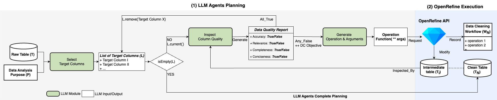

## AutoDCWorkflow🔗: LLM-based Data Cleaning Workflow Auto-Generation and Benchmark 

Code for paper [AutoDCWorkflow: LLM-based Data Cleaning Workflow Auto-Generation and Benchmark](https://arxiv.org/abs/2412.06724). 

### Introduction
We investigate the reasoning capability of large language models (LLMs) for automatically generating data-cleaning workflows. To evaluate LLMs' ability to complete data-cleaning tasks, we implemented a pipeline for LLM-based <strong>Auto</strong> <strong>D</strong>ata <strong>C</strong>leaning <strong>Workflow</strong> (AutoDCWorkflow), prompting LLMs on data cleaning operations to repair three types of data quality issues: duplicates, missing values, and inconsistent data formats. 


Figure. Architecture of AutoDCWorkflow framework. Given a raw table T that requires cleaning and a well-defined data analysis purpose P, our framework, AutoDCWorkflow outputs a minimal and clean table T<sub>N</sub> that is sufficient to address P, along with a complete data cleaning workflow W<sub> N</sub> consisting of a sequence of applied operations. This planning process involves three LLM agents: (1). <em>Select Target Columns</em>: Identifies a set of target columns related to the purpose, (2). <em>Inspect Column Quality</em>: Assess the data quality for each target column and generates a Data Quality Report as operation objectives, (3). <em>Generate Operation & Arguments</em>: Predicts the next operation and arguments based on the data quality report results. After predicting the next operation and its arguments, the framework sends a request to the OpenRefine API to apply the operation, resulting in an intermediate table T<sub>i</sub>. The revised target column in undergoes another quality inspection, and the iteration continues until the column meets the quality standards.


## Benchmark Description
The benchmark is proposed to evalaute the capability of LLM agents to automatically generate workflows that address data cleaning purposes of varying difficulty levels. The benchmark comprises the annotated datasets as a collection of purpose, raw table, clean table, data cleaning workflow, and purpose answer set. 

## Repo/Directories Introduction 

| Directory/File Name    | Description     |
|--------------|--------------|
| llm_wf_*.py | Main script running LLMs (in the file name)|
| prompts | prompt files for LLM agents in pipeline|
| [prompts/f_select_column.txt](https://github.com/LanLi2017/LLM4DC/blob/main/prompts/f_select_column.txt) | LLM agents I: Selecte Target Columns|
| prompts/learn_ops_*.txt | prompt files for learning operations|
| test.ipynb  | Main script running experiment analysis|
| CoT.response | Automatically generated results by models: Llama3.1, Mistral, and Gemma2 |
| CoT.response/model/datasets_llm | Cleaned tables by model |
| CoT.response/model/recipes_llm | Workflows/recipes by model |
| CoT.response/model/logging | Logging files |
| CoT.response/model/*.txt | JSON file for recording purpose, selected columns, and generated operations |
| datasets | Benchmark datasets |
| evaluation| evaluation scripts and results|
| golden_cases| golden cases by LLMs|
| refine | OpenRefine API folder|
| call_or.py|  OpenRefine API invocation script|
| requirements.txt | dependencies|


## Dependencies [TODO]
To establish the environment run this code in the shell:
```bash
conda env create -f 
pip install 
```
That will create the environment `autodc` we used.


## Usage
### Environment setup [TODO]
Activate the environment by running
``````shell
conda activate 
``````

### Run [TODO]
Check out commands in `.py`

## Citation
If you find our work helpful, please cite as
```
@article{li2024autodcworkflow,
  title={AutoDCWorkflow: LLM-based Data Cleaning Workflow Auto-Generation and Benchmark},
  author={Li, Lan and Fang, Liri and Torvik, Vetle I},
  journal={arXiv preprint arXiv:2412.06724},
  year={2024}
}
```

